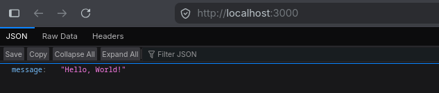
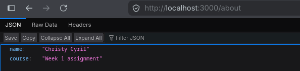
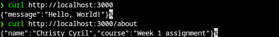

# Flyrank Intership

## Flyrank week 1 assignment
Build the smallest possible backend — a server with two JSON endpoints — call it from curl and your browser, and publish it to a public GitHub repository.

## Browser

## Curl

## FlyRank Week 2 Assignment

Build a complete CRUD REST API using Express and an in-memory data store. Create endpoints to list, retrieve, create, update, and delete tasks. Validate user input, return appropriate HTTP status codes, test the API using curl or Hoppscotch, and publish the project to a public GitHub repository.

## Curl

