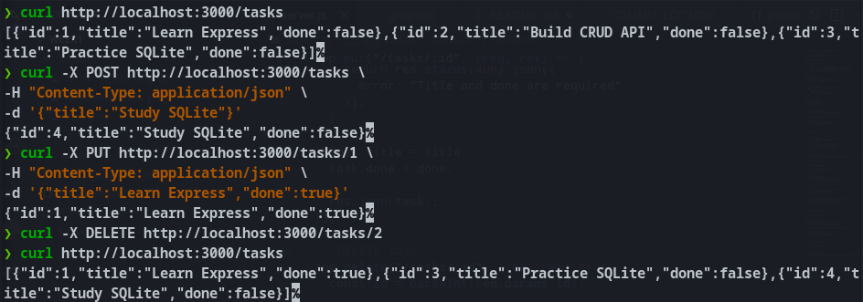
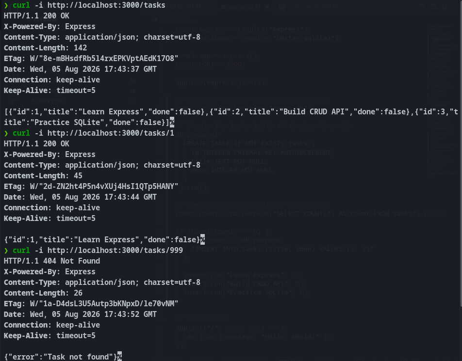
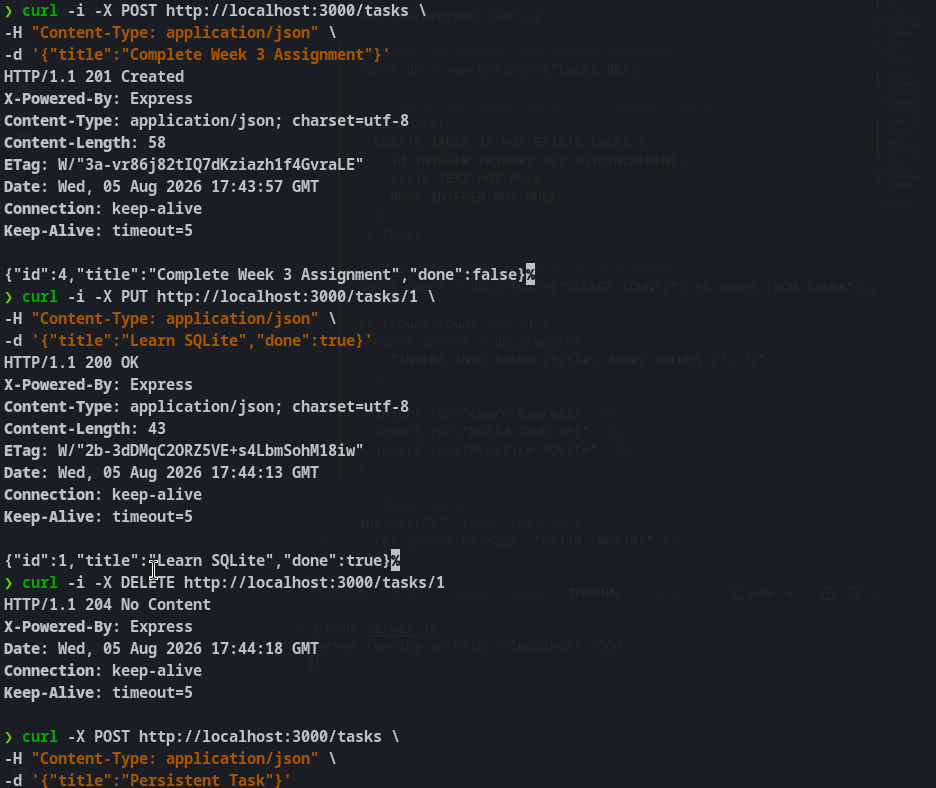

# Flyrank Intership

## Flyrank week 1 assignment
Build the smallest possible backend — a server with two JSON endpoints — call it from curl and your browser, and publish it to a public GitHub repository.

## Browser

## Curl

## FlyRank Week 2 Assignment

Build a complete CRUD REST API using Express and an in-memory data store. Create endpoints to list, retrieve, create, update, and delete tasks. Validate user input, return appropriate HTTP status codes, test the API using curl or Hoppscotch, and publish the project to a public GitHub repository.

## Curl

## FlyRank Week 3 Assignment

Upgrade your in-memory CRUD API to use a SQLite database for persistent storage. Keep the same REST endpoints while replacing the in-memory task list with SQL queries. Ensure the database and table are created automatically, seed initial tasks only once, verify data survives server restarts, and publish the updated project with documentation and a database screenshot.

## Curl

